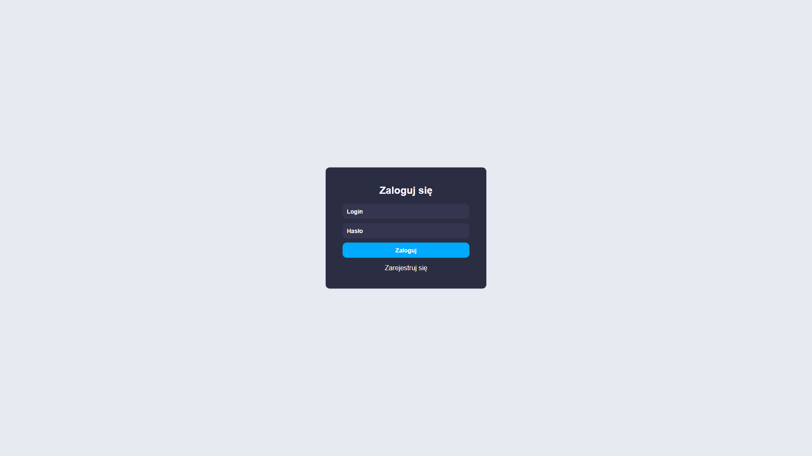
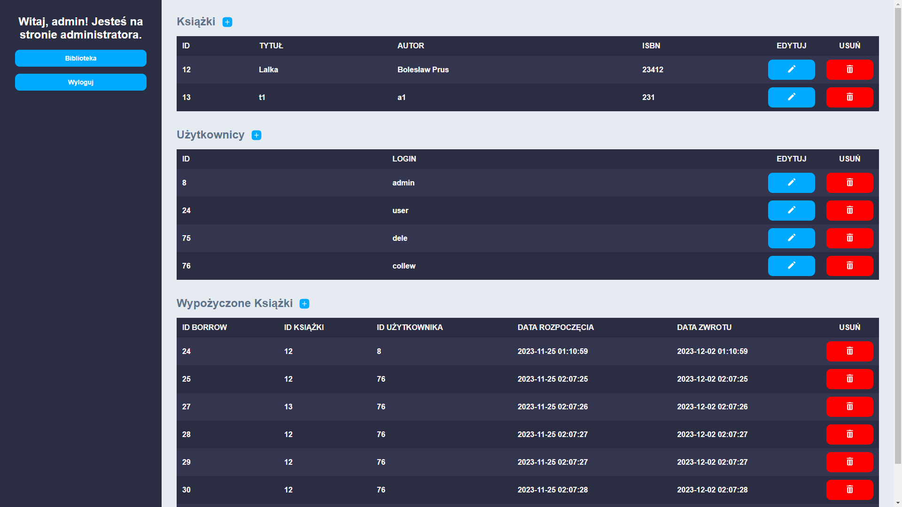
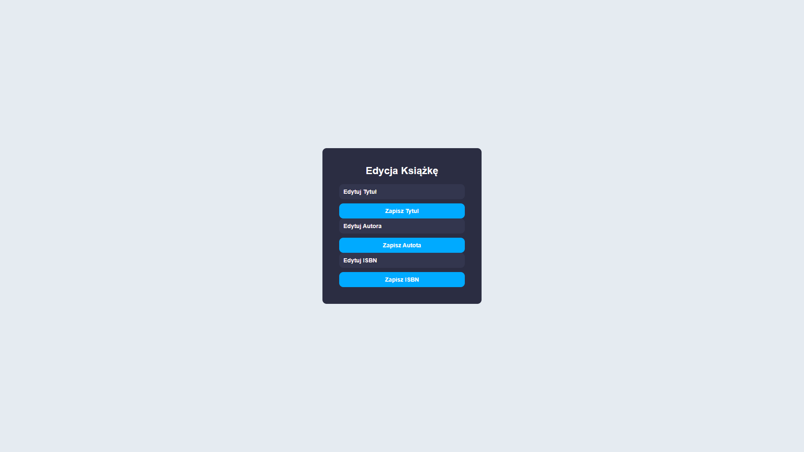
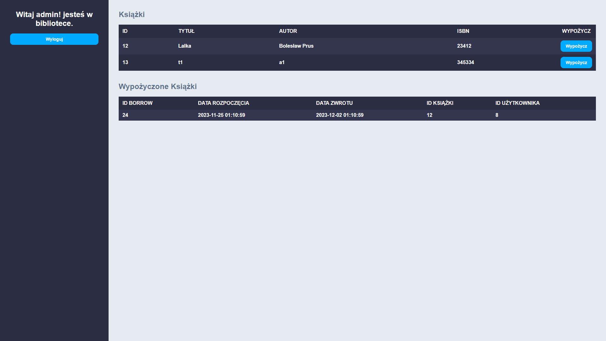

# System do zarządzania biblioteką
Projekt bibliteki PHP / Zadanie 
Gracjan Pietruszkiewicz

## Dane logowania
Administrator: admin admin 
Użytkownik: user user
 
## Wymagania funkcjonalne 

### Poziom użytkownik powinien mieć możliwość:
1. zalogowania się do systemu ✅ 
2. dostępu do strony z listą książek ✅ 
3. możliwość wypożyczenia ✅ 
4. wyświetlenie listy wszystkich wypożyczonych książek ✅ 
5. wylogowanie z systemu ✅

### Poziom dostępu admin powinien umożliwiać:
1. zalogowanie do systemu ✅
2. dla użytkowników 
    a) dodanie nowego użytkownika o poziomie dostępu użytkownika ✅ 
    b) edycję danych użytkownika w tym loginu oraz hasła niezależnie od siebie (symulacja przywrócenia utraconego hasła) ✅ 
    c) usunięcia użytkownika ✅ 
3. dla książek
    a) dodanie książki ✅ 
    b) edycję książki ✅ 
    c) usunięcie książki ✅ 
4. wypożyczenia 
    a) usunięcie wpisów o wypożyczeniach ✅ 
5. wylogowanie z systemu ✅

## Wymagania niefunkcjonalne

1. System powinien blokować dostęp dla niezalogowanych użytkowników ✅ 
2. System powinien rozróżniać zalogowanych użytkowników i przydzielać dostęp do stron w zależności od poziomu dostępu ✅ 
3. Wszystkie pola edycji powinny zawierać mechanizm postback - przy edycji pola powinny być uzupełnione, przy błędzie pola powinny zostać uzupełnione 🟡 
4. Podstawową walidację pól (sprawdzenie czy nie puste, czy dane odpowiadają polom po stronie klienta – html+JS i serwera - PHP ) 🟡 
5. System nie powinien wyświetlać warningów/noticów ✅ 
6. System powinien działać na wersji PHP conajmaniej 7.4 ✅ 
7. System powinien być oparty o bazę danych MySQL/MariaDB ✅ 
8. Struktura oraz wygląd powinny być oparte o technologię HTML5 oraz CSS3 ✅

## Wygląd

1. Strona powinna być oparta o sekcje ✅ 
2. Szablon strony powinien być podzielony conajmniej na dwie części (⅓ z lewej, ⅔ z prawej) ✅ 
3. Stylizacja strony powinna być oparta o CSS, wyklucza się użycie stylowania z poziomu HTML’a oraz przy wykorzystaniu zewnętrznych bibliotek ✅ 
4. Tabele powinny być w paski (co drugi wiersz w innym kolorze) dodatkowo po najechaniu na pole powinno się podświetlić (przybrać ciemniejszy odcień) ✅

